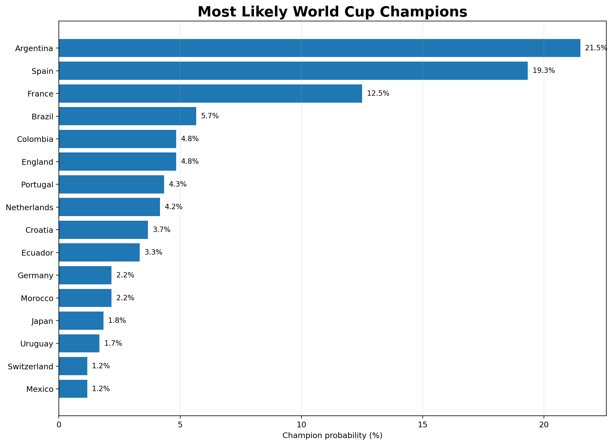
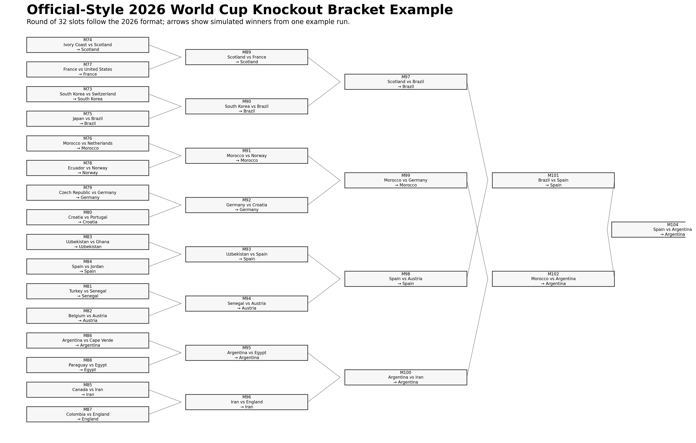

# 2026 World Cup Predictions

An Elo-based simulation project for forecasting the 2026 FIFA World Cup, from team-strength estimation to group-stage outcomes, knockout brackets, and championship probabilities.

The project builds optimized international-team Elo ratings from historical match results, uses those ratings to model match outcomes, and repeatedly simulates the 48-team World Cup format with Monte Carlo methods.

> **Project context:** this repository preserves a pre-tournament prediction model and its generated outputs. It is a probabilistic modeling project, not a record of the actual 2026 World Cup results.

## Preview

### Championship probabilities



### Example knockout bracket



## What this project does

The pipeline has two main stages:

1. **Estimate team strength** from historical international matches using an optimized Elo rating system.
2. **Simulate the World Cup** thousands of times to estimate qualification, knockout-stage, finalist, and champion probabilities.

The simulation models the expanded 2026 structure:

- 48 teams
- 12 groups of 4
- Top 2 teams from each group advance
- 8 best third-place teams advance
- 32-team knockout stage

## Repository structure

```text
2026-world-cup-predictions/
├── team_ratings.ipynb
├── optimized_elo_2026.csv
├── bracket_simulation.ipynb
├── wc26_visual_outputs/
│   ├── world_cup_visual_bracket_simulator.py
│   └── wc26_outputs/
│       ├── 01_group_stage_standings_grid.png
│       ├── 02_best_third_place_race.png
│       ├── 03_expected_points_vs_goal_difference.png
│       ├── 04_qualification_probability_all_teams.png
│       ├── 05_stage_probability_heatmap_top20.png
│       ├── 06_champion_probability_ranking.png
│       ├── 07_official_style_knockout_bracket.png
│       ├── 08_champion_path_to_final.png
│       ├── monte_carlo_champion_probabilities.csv
│       ├── monte_carlo_stage_probabilities.csv
│       └── example_*.csv
└── .gitignore
```

### `team_ratings.ipynb`

Builds the team-strength model. It:

- downloads historical international match results;
- initializes previously unseen national teams at an Elo rating of 1500;
- updates ratings chronologically after each match;
- gives different importance to different competition types;
- optimizes those competition weights against predictive accuracy; and
- exports the final 48-team ratings to `optimized_elo_2026.csv`.

### `optimized_elo_2026.csv`

The pre-tournament Elo ratings consumed by the tournament simulators. The highest-rated teams in the committed dataset are:

| Rank | Team | Elo |
|---:|---|---:|
| 1 | Spain | 2166.1 |
| 2 | Argentina | 2163.1 |
| 3 | France | 2119.6 |
| 4 | Brazil | 2063.8 |
| 5 | Colombia | 2039.1 |
| 6 | Portugal | 2031.1 |
| 7 | England | 2030.1 |
| 8 | Netherlands | 2008.3 |

### `bracket_simulation.ipynb`

Implements the core tournament simulation: group matches, standings, qualification, Round of 32 construction, knockout matches, and repeated Monte Carlo runs.

### `wc26_visual_outputs/world_cup_visual_bracket_simulator.py`

An extended simulation and visualization pipeline that produces the committed CSV tables and PNG assets. It includes an official-style Round of 32 layout and assigns qualified third-place teams to valid knockout slots using a deterministic backtracking solver.

## Elo model

For two teams with ratings `R_A` and `R_B`, the model starts from the classic Elo expected-score equation:

```text
P(A) = 1 / (1 + 10^(-(R_A - R_B) / 400))
```

Ratings are then updated after matches according to the observed result, expected result, goal-margin multiplier, and the importance of the competition.

### Optimized competition weights

Rather than choosing the Elo K-factors manually, `team_ratings.ipynb` optimizes them with SciPy's Nelder-Mead method. The objective is predictive performance measured by Brier score on modern international matches from 2000 onward.

The resulting K-factors are:

| Match type | Optimized K-factor |
|---|---:|
| Friendly | 27.09 |
| Qualifier | 30.77 |
| Continental competition | 27.41 |
| World Cup | 37.61 |

This gives the model a data-driven way to decide how strongly different matches should move a team's rating.

## Match simulation

### Group stage

Elo ratings are converted into three-way win/draw/loss probabilities. Draw probability increases when two teams are close in strength and decreases as their Elo gap grows.

A plausible scoreline is then sampled so the simulation can calculate:

- points;
- wins, draws, and losses;
- goals for and against; and
- goal difference.

For the current implementation, group ties are ordered by:

1. points;
2. goal difference;
3. goals scored; and
4. Elo rating as a final modeling tiebreaker.

The first three criteria mirror normal football standings logic; Elo is used as a practical stand-in when further competition-specific tiebreak procedures would otherwise be required.

### Knockout stage

Knockout advancement probabilities use the Elo expected-score function directly. Each simulation generates one winner and advances that team through the bracket until a champion is produced.

The extended visual simulator follows the 2026 Round of 32 slot structure and constrains best-third-place teams to eligible slots. The code notes that FIFA's full Annex C mapping can be substituted later for an exact lookup of every possible third-place combination.

## Monte Carlo results

Simulation counts are configurable. The simpler notebook contains a 1,000-run Monte Carlo example, while the committed visual-output pipeline was generated with 600 simulations and a fixed random seed.

The committed visual run produced these leading title probabilities:

| Team | Champion probability |
|---|---:|
| Argentina | 21.5% |
| Spain | 19.3% |
| France | 12.5% |
| Brazil | 5.7% |
| Colombia | 4.8% |
| England | 4.8% |
| Portugal | 4.3% |
| Netherlands | 4.2% |

Because this is Monte Carlo simulation, exact percentages vary with the random seed and number of simulations. Increasing the number of runs reduces sampling noise.

The complete probabilities are available in:

- `wc26_visual_outputs/wc26_outputs/monte_carlo_champion_probabilities.csv`
- `wc26_visual_outputs/wc26_outputs/monte_carlo_stage_probabilities.csv`

## Data source

Historical international match data is loaded in `team_ratings.ipynb` from the open `international_results` dataset maintained by Mart Jürisoo:

https://github.com/martj42/international_results

The source dataset includes match date, teams, score, tournament, location, and neutral-venue information.

## Running the project

### 1. Clone the repository

```bash
git clone https://github.com/hammondutra/2026-world-cup-predictions.git
cd 2026-world-cup-predictions
```

### 2. Create a virtual environment

```bash
python3 -m venv .venv
source .venv/bin/activate
```

### 3. Install the main dependencies

```bash
pip install pandas numpy scipy matplotlib jupyter
```

### 4. Rebuild the Elo ratings

```bash
jupyter notebook team_ratings.ipynb
```

Run the notebook cells in order. The final step writes `optimized_elo_2026.csv`.

### 5. Run the tournament notebook

```bash
jupyter notebook bracket_simulation.ipynb
```

This lets you inspect individual tournament simulations and Monte Carlo championship probabilities interactively.

### 6. Generate the full visual package

The visual generator was originally written with `/mnt/data` as its working directory. To run it directly from a local clone, change:

```python
BASE_DIR = Path('/mnt/data')
```

to:

```python
BASE_DIR = Path('.')
```

Then run:

```bash
python wc26_visual_outputs/world_cup_visual_bracket_simulator.py
```

## Generated visualizations

The repository contains eight ready-to-use analytical graphics:

1. Group-stage standings grid
2. Best third-place qualification race
3. Expected points vs. goal difference
4. Qualification probability for all 48 teams
5. Stage-probability heatmap for the strongest teams
6. Champion-probability ranking
7. Full knockout bracket
8. Simulated champion's path to the final

These outputs make the project useful both as a quantitative analysis and as a visual explanation of how the model sees the tournament.

## Modeling limitations

This is a deliberately interpretable forecasting model rather than a full football analytics system. Important limitations include:

- Elo compresses team strength into a single rating and does not model player-level information, injuries, lineups, tactics, or squad changes.
- The scoreline generator is heuristic rather than a fitted goals model such as Poisson or expected-goals regression.
- Group-stage final tiebreaks use Elo after points, goal difference, and goals scored instead of implementing every FIFA tiebreak criterion.
- The third-place knockout assignment respects eligible slot constraints but does not encode FIFA Annex C as a complete combination-by-combination lookup table.
- Monte Carlo estimates have sampling noise, especially at lower simulation counts.

These constraints are intentional: the goal is to create an understandable end-to-end prediction system that can be iterated on and tested.

## Possible next steps

Potential improvements include:

- increasing Monte Carlo runs to 10,000+;
- replacing heuristic score generation with a Poisson or expected-goals model;
- adding home/host-country effects;
- incorporating recency decay into historical match weighting;
- implementing FIFA's full official tiebreak and Annex C rules;
- calibrating draw probabilities from historical data;
- adding player availability and squad-strength features; and
- backtesting the complete tournament model on previous World Cups.

## Author

**Hammon Dutra**  
GitHub: [@hammondutra](https://github.com/hammondutra)

---

Predictions are probabilistic model outputs and should be interpreted as estimates rather than certainties.